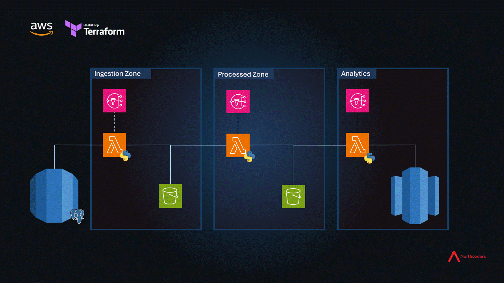

# AWS ETL Pipeline (Northcoders Final Project)

## Overview

This project is a cloud ETL (Extract, Transform, Load) pipeline that automates data movement and transformation from a live PostgreSQL relational database (ToteSys) into a data warehouse for analytics. 

The system is deployed in AWS using hashicorp terraform (infrastructure-as-code), Python, SQL, database modelling, CICD, DevOps practices and Agile working

At the end of the project the system was populating, however areas of the group project, I feel, need refactoring.

## Personal Contribution

Personally I contributed to many aspects of the code, however if you wish to see an example of my work, please look at these following files:
- src/lambda_transform_utils.py 
- src/lambda_load.py 
- test/test_lambda_2_TDD.py

These are files that Connor and I wrote using TDD and they create the "T" (transform) stage of the pipeline. In this stage json data is taken from one s3 bucket, transformed according to the star schema requested and then saved as a parquet file ready for analysis. Hopefully in reading the file you can observe some of the following practices:
- Requirements being transferred into the testing file and being individually tested against
- Tests being written before their util functions were written
- Fixtures being used
- Moto3, a module that allows you to mock (simulate) a deployment to AWS
- Docstrings, for tests and functions
- Orderly code (though I would admit the files I've highlighted aren't perfect)

Other actions I undertook in the project:
- Various refactors to terraform code to include new functionality and the removal of hardcoding
- Working within branches and merging changes
- Mentoring of other team members not from technical backgrounds
- Refactoring elements of the other python methods
    - Removing hardcodings
    - Ensuring that AWS secret manager with passing tokens into applications 

## Contributors

Alphabetically listed:

- Brendan Corbett [GitHub](https://github.com/BrendanC8450)
- Connor Creed [GitHub](https://github.com/creedy293) | [LinkedIn](https://www.linkedin.com/in/c-creed-942132231/)
- Fabio Greenwood [GitHub](https://github.com/FabioGreenwood) | [LinkedIn](https://www.linkedin.com/in/fabio-greenwood-b0832676/)
- Tor Satherley [GitHub](https://github.com/TorSatherley) | [LinkedIn](https://www.linkedin.com/in/tor-satherley-95a789265/)
- Vincent Toor-Azorin [Github](https://github.com/Armatoor147) | [LinkedIn](https://www.linkedin.com/in/vincent-toor-azorin/)
